# JAVASCRIPT

alert("hello"):-  Gives a popup saying hello

This is exactly what javascript does, we give instructions to computer and it returns something back

javascript is case sensitive

document.body.innerHTML='Hello';    :- removes everything in body of webpage and display hello

## Numbers And Math

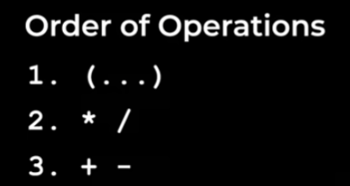

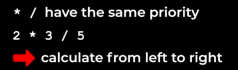

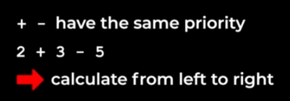

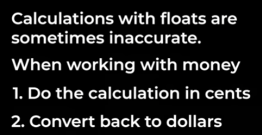

## rounding Numbers:- Math.round()

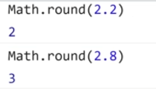

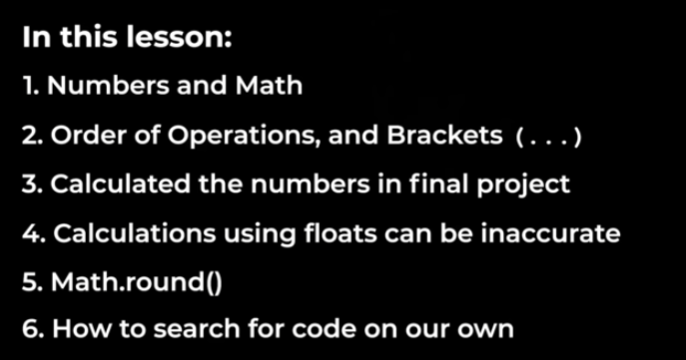

## STRINGS

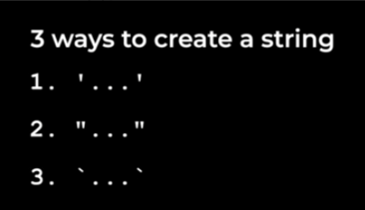

### Concatenation

'some' + 'text' returns 'sometext'

'some' + 'more' + ' text' returns 'somemore text'

### typeof 2  :- returns 'number'

### typeof 'hello'  :- returns 'string'

'hello' + 3 
converted into
'hello' + '3'
finally returns 'hello3' 
  3 is converted into a string

### This is known as Type coercion (automatic type conversion )

How to get $28.94

wrong:-  '$' + 20.95 + 7.99 this returns '$20.957.99'

ie (1) '$20.95' + 7.99

   (2) '$20.957.99'

 partially correct:- '$' (20.95+7.99) this will return '$28.9399999999999999998'

but we need 28.94

correct:- '$' + (2095+799)/100 returns
'$28.94'

-------------------------------------------

'Items(' +(1+1)+ '): $' + (2095+799)/100
returns
'Items(2): $28.94'

------------------------------------------

-----------------------------------------

These template string have some special features(just line f-strings in python)

1) Interpolation = insert value directly into a string
Ex:- 'Items($(1+1))' = Items(2)

2) Multi-line string:- 'some
                        text'

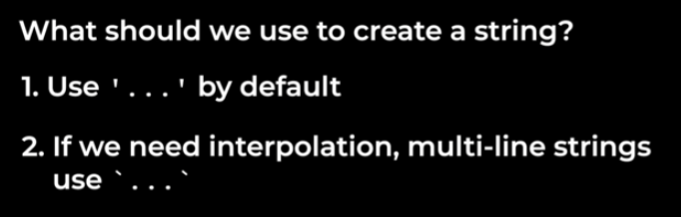                        

--------------------------------------------

## javascript code in html file

USE  to write java script code in it
 

attributes for JS:-

onclick=" js code " 
   EX:-  onclick="alert('Good Job')";

  

The JS code inside  runs first than onclick JS code runs first  

### Comments in JS

// This is a comment

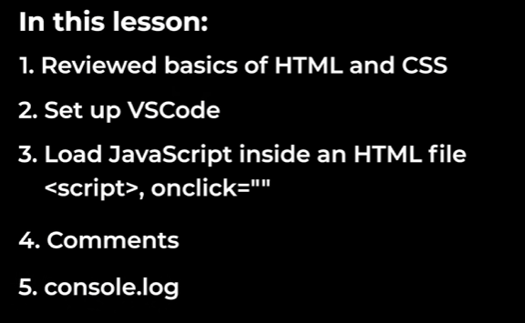

## Variables

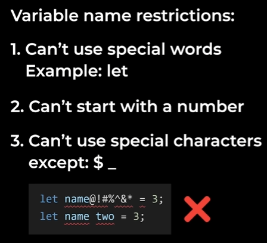

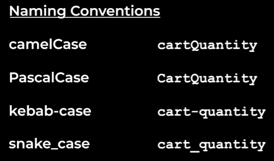

camelCase is used generally in JAVASCRIPT

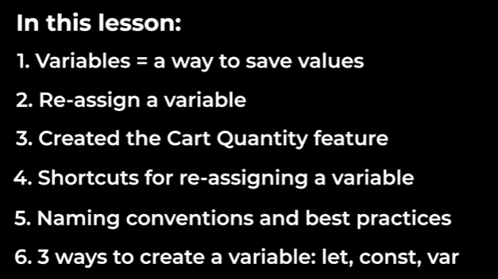

--------------------------------

Boolens and if-statements

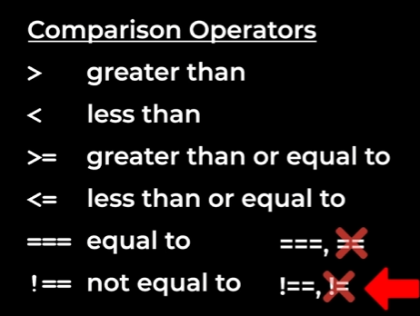

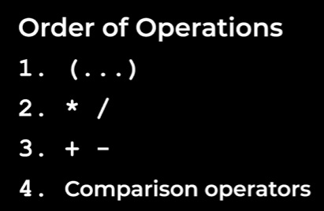

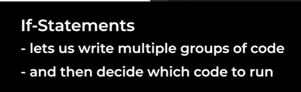

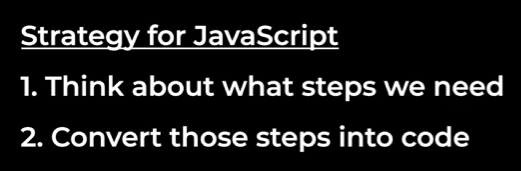

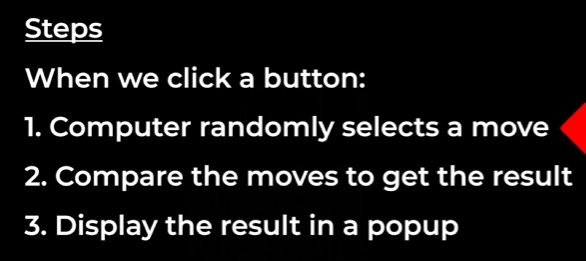

Math.random() :- generates a random number btw 0 and 1

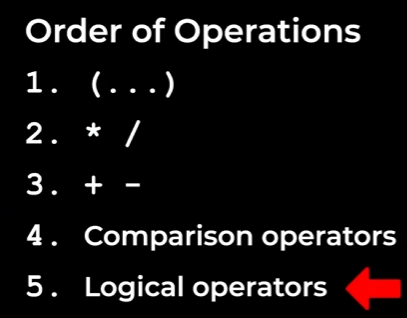

var doesnt follow the rules of scope

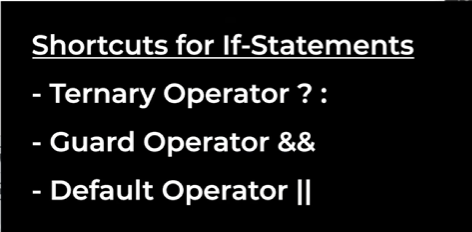

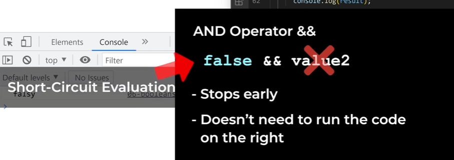

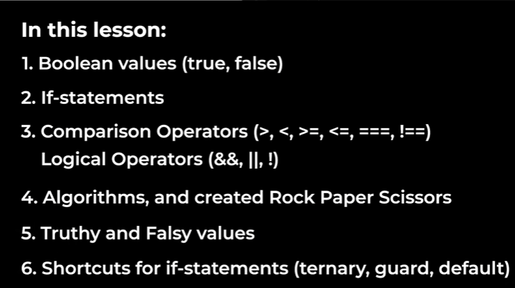

-----------------------------------------------

Functions:-

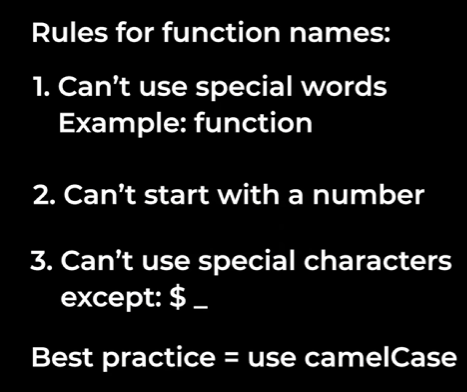

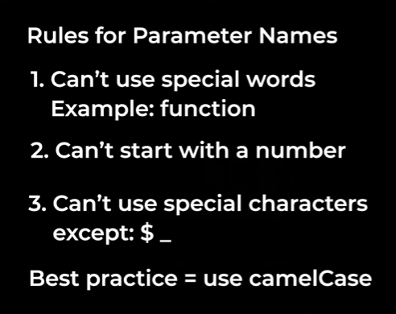

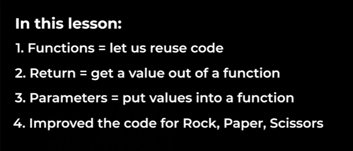